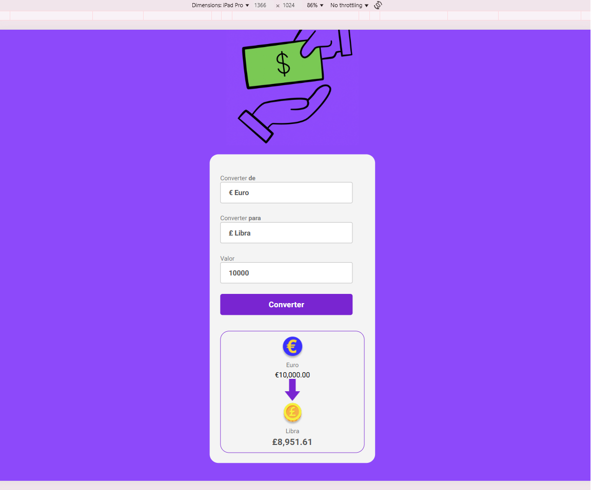

# 💰 Convert Money

Projeto desenvolvido no **DevClub** para praticar HTML, CSS e JavaScript criando um conversor de moedas.

Permite converter entre diversas moedas como **Real, Dólar, Euro, Libra e Bitcoin**, com interface intuitiva e responsiva.
---

## 📸 Preview

![preview]

---

## 🚀 Funcionalidades

- Converter valores entre:
  - Real Brasileiro (BRL)
  - Dólar Americano (USD)
  - Euro (EUR)
  - Libra Esterlina (GBP)
  - Bitcoin (BTC)
- Atualização dinâmica dos valores, nomes e bandeiras ao selecionar moedas
- Conversão feita diretamente no navegador
- Validação de input para evitar erros

---

## 🧪 Tecnologias utilizadas

- HTML5
- CSS3
- JavaScript 
- [Intl.NumberFormat](https://developer.mozilla.org/pt-BR/docs/Web/JavaScript/Reference/Global_Objects/Intl/NumberFormat) para formatação de moedas
---

Currency--converter--/
├── index.html
├── style.css
├── scripts.js
├── assets/
│   ├── logo.gif
│   ├── brasil 2.png
│   ├── dolar.png
│   ├── euro.png
│   ├── libra.png
│   ├── bitcoin.png
│   └── seta.png

📌 Próximas melhorias
 Buscar valores de câmbio reais via API (Ex: ExchangeRate API)

 Adicionar tema escuro

 Responsividade total para mobile

 Histórico de conversões

